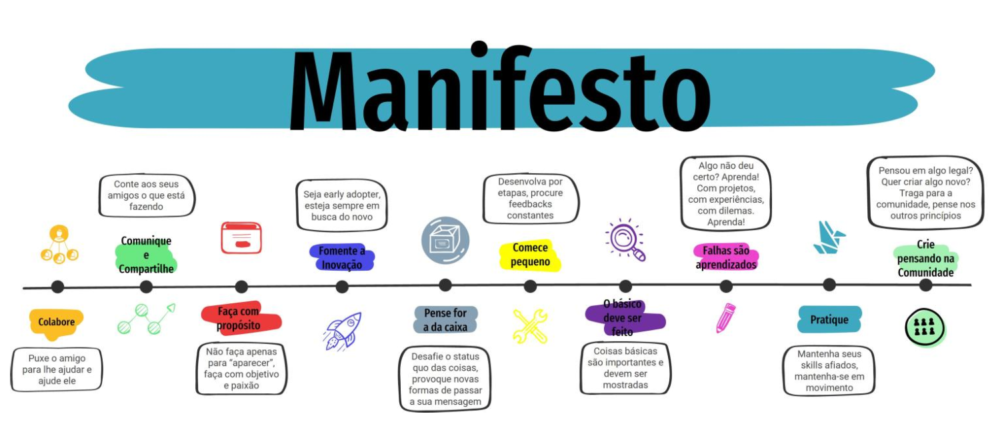

# Bem-vindo a nossa Comunidade 👯

 

### Tecnologias com as quais trabalhamos

  
  
  
  
  

### Provedores de Nuvem com os quais trabalhamos

  
  &nbsp;
  
  

 

<!-- 

  
  

- 🔭 I’m currently working on AWS
- 🌱 I’m currently learning about cloud providers
- 📫 How to reach me: felipe.grucci@gmail.com
👯 I’m looking to collaborate on ...
- 🤔 I’m looking for help with ...
- 💬 Ask me about ... 
- - 😄 Pronouns: ...
- ⚡ Fun fact: ...

http://code.benco.io/icon-collection/azure-icons/
https://dev.to/
https://dev.to/envoy_/150-badges-for-github-pnk
https://devicon.dev/
https://shields.io/
https://c.tenor.com/4P02Cdfd26MAAAAj/baby-yoda-so-cute.gif
https://c.tenor.com/XrEozUwGI_oAAAAC/groot-this.gif
langs_count=7&
--!>
